# 数据结构

# 一、数据分类

逻辑结构可分：

*   集合：数据结构中的元素之间除了“同属一个集合” 的相互关系外，别无其他关系；
*   线性结构：数据结构中的元素存在一对一的相互关系；
*   树形结构：数据结构中的元素存在一对多的相互关系；
*   图形结构：数据结构中的元素存在多对多的相互关系。


常见的存储结构有： 

*   顺序存储
*   链式存储 
*   索引存储
*   散列存储 


八大数据类型：

*   数组
*   栈
*   队列
*   链表
*   树
*   图
*   堆
*   散列表

线性结构：数组、栈、队列、链表、散列表


# 二、数组

数组在内存中的分配是连续的，元素存储也是连续的。通过数组下标进行访问

**优点：**

*   有索引存储，所以访问速度快

**缺点：**

*   数组大小固定，无法扩容

*   数组只能存储一种数据类型

*   数组新增、删除会对整个数组进行复制操作，所以速度慢


```java 
// 声明并创建一个数组：
int[] a = new int[N]
// 初始化一个输出
a[i] = 1；

// 简写：
int[] a = {1,2,3,4,5,6}

int[] b = a ; // 这只是引用地址的复制
b[2] = 100;  // a[2] 的值也会变成 100
```


## 常见处理

**找出数组中最大值**

```java
int[] a = {1,2,3,4,5,6};
int max = a[0];
for (int i : a){
    if (i > max){
        max = i;
    }
}
System.out.println(max);
```

**计算数组元素平均值**

```java 
int[] a = {1,2,3,4,5,6};
int sum = 0 ;
for (int i : a){
    sum += i;
}
System.out.println(sum);
```

**复制数组**

```java
int[] a = { 1, 2, 3, 4, 5, 6 };

int[] b = new int[a.length];
for (int i = 0; i < a.length; i++) {
    b[i] = a[i];
}

// 或者
System.arraycopy(a, 0, b, 0, a.length);
```

**颠倒数组**

```java
int[] a = { 1, 2, 3, 4, 5, 6 };

int n = a.length;
for (int i = 0; i < n/2; i++) {
    int temp = a[i];
    a[i] = a[n-1-i];
    a[n-1-i] = temp;
}
System.out.println(Arrays.toString(a));
```


## 矩阵

对称矩阵、三角矩阵

-------------------（正在建设中，敬请期待！！！！）


# 三、栈

栈是一种特殊的线性表，仅能在表的一端进行插入和删除操作，通常操作的一端为栈顶(Top)，另一端为栈底(Bottom)。当top= -1时为空栈，top=0表示栈中只有一个元素

栈的特点是：**先进后出，或者说是后进先出**，简称“LIFO”

当栈满时进栈称为 “上溢”；当栈空时退栈称为 “下溢”，

堆栈的存储结构有 顺序存储结构 和 链式存储结构 ，在顺序结构下需要考虑 “上溢”；在链式存储结构下不需要考虑 “上溢”，只需要考虑 “下溢”

堆栈溢出一般是循环的递归调用、大数据结构的局部变量导致的

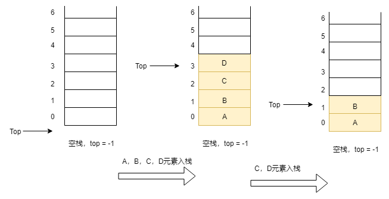

我们以手枪弹夹为例，是不是很经典！！！！

<figure class="half">
    
    
</figure>


**Stack**

我们之前学过了集合，知道 Vector 集合有个子类 Stack 堆栈，

所以 Stack  继承了Vector 的特性，**也是线程安全；**

```java
public class Stack<E> extends Vector<E> {
    public E push(E item) {  // 将元素推送到此堆栈的顶部。
        addElement(item);  // 该方法已经是线程安全的了
        return item;
    }
    public synchronized E pop() { // 删除此堆栈顶部的对象，并将该对象作为此函数的值返回。
        E   obj;
        int  len = size();
        obj = peek();
        removeElementAt(len - 1);
        return obj;
    }
    public synchronized E peek() { 	//查看此堆栈顶部的对象，而不从堆栈中删除它。
        int len = size();
        if (len == 0) throw new EmptyStackException();
        return elementAt(len - 1);
    }
    public boolean empty() { // 测试此堆栈是否为空。
        return size() == 0;
    }
    public synchronized int search(Object o) { // 返回一个对象在此堆栈上的基于1的位置。
        int i = lastIndexOf(o);
        if (i >= 0)  return size() - i;
        return -1;
    }
}
```


# 四、队列

## 1、队列特性


队列和栈相似，是另一种顺序存储元素的线性数据结构。

*   **有两个指针 front、rear指向对头 和队尾；**

*   队头(front)一端进行删除操作，队尾(rear)一端进行插入操作，**是FIFO，即先进先出**

*   使用场景：因为队列先进先出的特点，在多线程阻塞队列管理中非常适用。

*   栈与队列的区别：最大差别在于**栈是LIFO（后进先出）**

*   队列分：顺序队列 、循环队列、链式队列

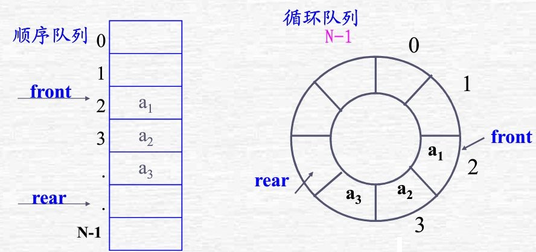


## 2、顺序队列

### 1> 顺序对象过程

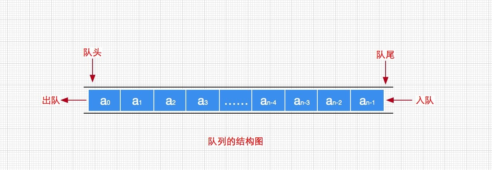

队列过程：

*   队头和队尾的指针在初始化是都为指向 0
*   当插入一个元素时，rear 加 1；
*   当删除一个元素时，front 减 1；

**由此可见：当 front = rear 时，队列为空。**


### 2>  假溢出现象

当队列经过新增，有经过删除时。即此时 front = rear 时，队列为空；但是在添加元素时，可能会发生 **“假溢出” 现象**，如图：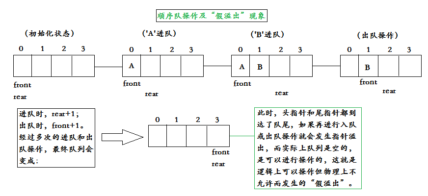

假溢出现象解决方案：

1.  使用一个计数器记录队列中元素个数（即队列长度）
2.  使用循环队列，人为浪费一个单元，令队满特征为 front = (rear +1)%maxSize


## 3、循环队列

**循环队列是改进版的顺序队列，没有“假溢出”现象**

**在顺序队列中，当rear=front的时候，队列可能是满，也可能是空。**

因此循环队列，加入了对 满和空两种情况的判断：

*   **队满**：添加元素时，rear + 1 指向了 head 的元素。也就是转圈子要碰头了，就认为队列满了。即：**front (rear+1)%MAXSIZE**

*   **队空**：删除元素到 head = rear 的时候，我们认为队列空了。**rear == front，不一定为0**


**Java 循环实现**

```java
public class ArrayQueue {
	Object[] elementData; // 对象数组，队列最多存储a.length-1个对象
	int front; // 队首下标
	int rear; // 队尾下标

	public ArrayQueue() {
		this(10); // 调用其他构造方法
	}

	public ArrayQueue(int size) {
		elementData = new Object[size];
		front = 0;
		rear = 0;
	}

	// 入队
	public boolean push(Object obj) {
		if ((rear + 1) % elementData.length == front) { // 关键步骤 判断是否队满 
			return false;
		}
		elementData[rear] = obj;
		rear = (rear + 1) % elementData.length;  // 关键步骤 队尾指针后移
		return true;
	}

	// 出队 
	public Object pop() {
		if (rear == front) {	//  关键步骤 判断是否队空
			return null;
		}
		Object obj = elementData[front];
		front = (front + 1) % elementData.length;  // 关键步骤 队头指针后移
		return obj;
	}

	public static void main(String[] args) {
		ArrayQueue q = new ArrayQueue(4);
		System.out.println(q.push("张三")); // true
		System.out.println(q.push("李斯")); // true
		System.out.println(q.push("赵五")); // true
		System.out.println(q.push("王一")); // false 无法入队列，队列满
		for (int i = 0; i < 4; i++) {
			System.out.println(q.pop());
		}
		/* 循环体输出 ：
		 * 张三
		 * 李斯 
		 * 赵五 
		 * null
		 */
	}
}
```


## 4、链式队列

链式存储结构，限制仅在表头删除和表尾插入的单链表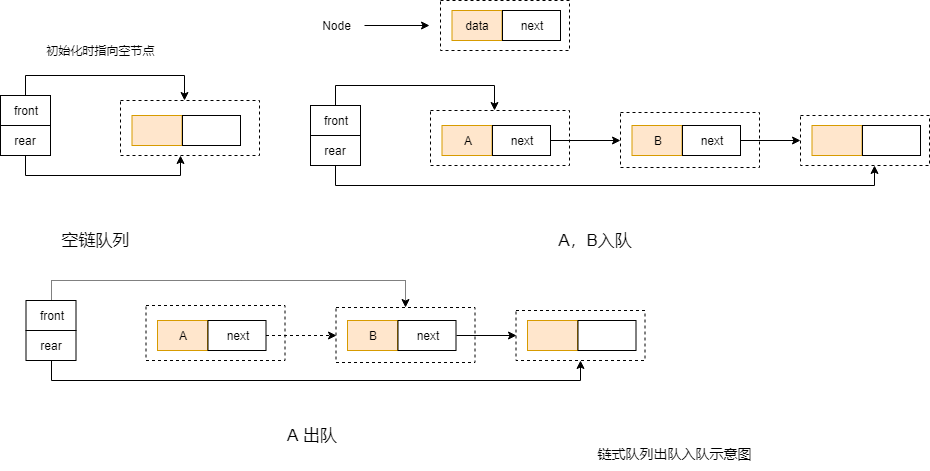

代码实现

```java
public class LinkQueue<T> {
	// 定义一个内部类Node，Node实例代表链队列的节点。
	private class Node {
		private T data;// 保存节点的数据
		private Node next;// 指向下个节点的引用

		// 初始化全部属性的构造器
		public Node(T data, Node next) {
			this.data = data;
			this.next = next;
		}
	}

	private Node front;// 保存该链队列的头节点
	private Node rear;// 保存该链队列的尾节点

	public LinkQueue() {
		// 空链队列，front和rear都是null
		front = null;
		rear = null;
	}

	public LinkQueue(T element) {
		front = new Node(element, null);
		// 只有一个节点，front、rear都指向该节点
		rear = front;
	}

	/**
	 * 入队
	 * 
	 * @param element
	 */
	public void offer(T element) {
		Node newNode = new Node(element, null);// 创建新节点
		// 如果该链队列还是空链队列
		if (front == null) {
			front = newNode;
			rear = front; // 只有一个节点，front、rear都指向该节点
		} else {
			rear.next = newNode;// 让尾节点的next指向新增的节点
			rear = newNode;// 以新节点作为新的尾节点
		}
	}

	/**
	 * 出队
	 * @return
	 */
	public T poll() {
		if (front == null ) {
			return null;
		}
		Node oldFront = front;
		front = front.next; // 将队头指针更改为指向 下一个节点
		oldFront.next = null;
		return oldFront.data;
	}

	public static void main(String[] args) {
		LinkQueue<String> q = new LinkQueue<>();
		q.offer("张三");
		q.offer("李斯");
		q.offer("赵五");
		q.offer("神兽");
		for (int i = 0; i < 5; i++) {
			System.out.println(q.poll());
		}
	}
}

//  输出：
张三
李斯
赵五
神兽
null
```


# 五、链表

## 1、链表特性

*   链表和数组作为算法中的两个基本数据结构

*   由节点（Node）组成的，每个结点只能知道下一个结点的存储位置，一个链表拥有不定数量的节点。整个链表向外暴露的只有一个头节点（Head），我们对链表的**所有操作，都是通过头节点来进行的。** 
*   链表的数据在内存中存储是不连续的，它存储的数据分散在内存中


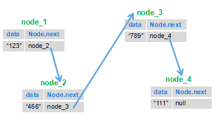


优点： 

*   不需要初始化容量，可以任意加减元素； 
*   添加或者删除元素时只需要改变前后两个元素结点的指针域指向地址即可，所以**插入，删除很快；**

缺点： 

*   因为含有大量的指针域，占用空间较大； 
*   查找元素需要遍历链表来查找，非常耗时。


适用场景： 数据量较小，需要频繁增加，删除操作的场景


链表有：单向链表，双向链表，有序链表


## 2、单向链表

单向链表只可向一个方向遍历

*   查找一个节点的时候需要从第一个节点开始每次访问下一个节点，一直访问到需要的位置。

*   插入一个节点，对于单向链表，我们只提供在链表头插入，只需要将当前插入的节点设置为头节点，next指向原头节点即可。

*   删除一个节点，我们将该节点的上一个节点的next指向该节点的下一个节点。


**单链表的缺陷**

单链表只能从头结点开始访问链表中的数据元素，如果需要逆序访问单链表中的数据元素将极其低效。


**实现单向链表**

1.  定义属性 头结点，以及 结点类

    ```java
    public class SingleLinkedList {
        // 链表的每个节点类
    	private class Node<E> {
    		private E item;// 每个节点的数据
    		private Node<E> next;// 每个节点指向下一个节点的连接
    
    		Node(E element, Node<E> next) {
    			this.item = element;
    			this.next = next;
    		}
    	}
    
       	private int size = 0;// 链表节点的个数
    	private Node<E> first;// 头节点
    
    }
    ```

    

2.链表新增方法

```java
/**
* 插入元素到头部
* @param e
*/
public void linkFirst(E e) {
    first = new Node<>(e, first);
    size++;
}
/**
* 插入元素到尾部
* 
* @param e
*/
public void linkLast(E e) {
    final Node<E> newNode = new Node<>(e, null);
    Node<E> temp = first;
    if (temp == null) {
        first = newNode;
        return;
    }

    // 遍历，找到最后一个节点
    while (temp.next != null) {
        temp = temp.next;
    }
    temp.next = newNode;
    size++;
}
/**
* 插入元素到指定结点位置之后
* 
* @param e
*/
public void linkAfter(E e, Node<E> pred) {
    final Node<E> newNode = new Node<>(e, null);
    newNode.next = pred.next;
    pred.next = newNode;
    size++;
}
// 插入元素到指定位置之后
public void add(int index, E element) {
    if (index >= size){
        linkLast(element);
    }else{
        linkAfter(element, node(index));
    }
}
```

3.链表删除方法

```java
public boolean remove(Object obj) {
    if (first == null) {
        return false;
    }

    if (first.item == obj) {
        first = first.next;
        size--;
        return true;
    }

    Node<E> prev = first;
    Node<E> current ;
    while ((current = prev.next) != null && current.item != obj) {
        prev = current;
    }
    prev.next = current.next;
    size--;
    return true;
}
```

4.查询元素

```java
// 从表头开始，依次对比，知道找到了节点Node并返回，否则返回null
public Node<E> find(Object obj) {
    Node<E> e = first;
    if(obj.equals(e.item)) {
        return e;
    }
    while (e.next !=null) {
        e = e.next;
        if(obj.equals(e.item)) {
            return e;
        }
    }
    return null;
}
```


5.测试：

```java
public void show() {
    print(head);
}
private Node print(Node node) {
    if (node != null ) {
        System.out.print(node.data);
        print(node.next);
    }
    return null;
}

public static void main(String[] args) {
    SingleLinkedList sll = new SingleLinkedList();
    sll.add("A");
    sll.add("B");
    sll.add("C");
    sll.add("D");
    sll.show();

    System.out.println();
    sll.add(1, "3");
    sll.show();


    System.out.println();
    sll.remove("3");
    sll.show();

    System.out.println();
    sll.print(sll.find("B"));
}
```

输出：

```java
DCBA
DC3BA
DCBA
BA
```


## 3、循环链表

循环链表，存储结构与单向链表类似，在单向链表上改进，可以解决单向链表中单方向查找的缺点

原理：在单链表的尾节点的指针**从指向 null  变为指向 头结点**，在逻辑上形成一个环型。


循环链表的插入与删除基本等同于单向链表，差别仅在于：

*   在插入时**将最后一个节点的 next 指向 first节点**
*   在判断是否为尾节点的地方，**将判断 `current.next != null ` 改为 `current.next != first`**


## 4、双向链表

*   双链表是链表的一种，由节点组成，**包含两个指针，一个prev指向前一个节点，一个next指向后一个节点。**
*   所以，从双向链表中的任意一个结点开始，都可以很方便地访问它的前驱结点和后继结点。一般我们都构造双向循环链表


**双向循环链表：** 最后一个节点的 next 指向head，而 head 的prev指向最后一个节点，构成一个环。


```java
/**
 * Java 实现的双向链表。 
 * 注：java自带的集合包中有实现双向链表，路径是:java.util.LinkedList
 *
 * @author skywang
 * @date 2013/11/07
 */
public class DoubleLink<T> {

    // 表头
    private DNode<T> mHead;
    // 节点个数
    private int mCount;

    // 双向链表“节点”对应的结构体
    private class DNode<T> {
        public DNode prev;
        public DNode next;
        public T value;

        public DNode(T value, DNode prev, DNode next) {
            this.value = value;
            this.prev = prev;
            this.next = next;
        }
    }

    // 构造函数
    public DoubleLink() {
        // 创建“表头”。注意：表头没有存储数据！
        mHead = new DNode<T>(null, null, null);
        mHead.prev = mHead.next = mHead;
        // 初始化“节点个数”为0
        mCount = 0;
    }

    // 返回节点数目
    public int size() {
        return mCount;
    }

    // 返回链表是否为空
    public boolean isEmpty() {
        return mCount==0;
    }

    // 获取第index位置的节点
    private DNode<T> getNode(int index) {
        if (index<0 || index>=mCount)
            throw new IndexOutOfBoundsException();

        // 正向查找
        if (index <= mCount/2) {
            DNode<T> node = mHead.next;
            for (int i=0; i<index; i++)
                node = node.next;

            return node;
        }

        // 反向查找
        DNode<T> rnode = mHead.prev;
        int rindex = mCount - index -1;
        for (int j=0; j<rindex; j++)
            rnode = rnode.prev;

        return rnode;
    }

    // 获取第index位置的节点的值
    public T get(int index) {
        return getNode(index).value;
    }

    // 获取第1个节点的值
    public T getFirst() {
        return getNode(0).value;
    }

    // 获取最后一个节点的值
    public T getLast() {
        return getNode(mCount-1).value;
    }

    // 将节点插入到第index位置之前
    public void insert(int index, T t) {
        if (index==0) {
            DNode<T> node = new DNode<T>(t, mHead, mHead.next);
            mHead.next.prev = node;
            mHead.next = node;
            mCount++;
            return ;
        }

        DNode<T> inode = getNode(index);
        DNode<T> tnode = new DNode<T>(t, inode.prev, inode);
        inode.prev.next = tnode;
        inode.next = tnode;
        mCount++;
        return ;
    }

    // 将节点插入第一个节点处。
    public void insertFirst(T t) {
        insert(0, t);
    }

    // 将节点追加到链表的末尾
    public void appendLast(T t) {
        DNode<T> node = new DNode<T>(t, mHead.prev, mHead);
        mHead.prev.next = node;
        mHead.prev = node;
        mCount++;
    }

    // 删除index位置的节点
    public void del(int index) {
        DNode<T> inode = getNode(index);
        inode.prev.next = inode.next;
        inode.next.prev = inode.prev;
        inode = null;
        mCount--;
    }

    // 删除第一个节点
    public void deleteFirst() {
        del(0);
    }

    // 删除最后一个节点
    public void deleteLast() {
        del(mCount-1);
    }
}
```


# 六、树

树：由根结点和若干子结点构成的结合体

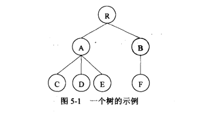

## 1、基础术语

*   **节点的度**：指一个结点的子树个数，
*   **树的度**：一棵树中，最大的节点的度称为树的度；
*   **叶结点或终端节点**：指度为零的结点，即没有子树的结点
*   **非终端节点或分支节点**：度不为0的节点；
*   **双亲节点或父节点**：若一个节点含有子节点，则这个节点称为其子节点的父节点；
*   **孩子节点或子节点**：一个节点含有的子树的根节点称为该节点的子节点；
*   **兄弟节点**：具有相同父节点的节点互称为兄弟节点；
*   **节点的层次**：从根开始定义起，根为第1层，根的子节点为第2层，以此类推；
*   **树的高度或深度**：树中节点的最大层次；
*   **堂兄弟节点**：双亲在同一层的节点互为堂兄弟；
*   **节点的祖先**：从根到该节点所经分支上的所有节点；
*   **子孙**：以某节点为根的子树中任一节点都称为该节点的子孙。
*   **森林**：由m（m>=0）棵互不相交的树的集合称为森林；


## 2、树分类

二叉树：有n(n>=0) 结点组成的有限集合。此集合或为空、或由一个跟结点加上两个分别称为左右子树的，互不相交的二叉树组成。

*   二叉树第 i 层上的结点数最多为 2 ^i-1^
*   高度为 k 的二叉树最多有2^k^-1 个几点

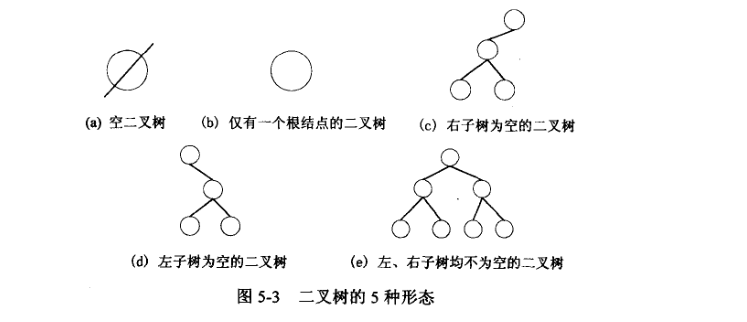

分类

*   无序树：树中任意节点的子结点之间没有顺序关系，这种树称为无序树,也称为自由树;

*   有序树：树中任意节点的子结点之间有顺序关系，这种树称为有序树；

*   二叉树：每个节点最多含有两个子树的树称为二叉树；

*   完全二叉树：指一棵二叉树最下面的两层结点的度数可以小于 2 ，并且最下一层上的结点数都集中在该层最左边的若干位置上。

*   满二叉树：每层的结点数都达到最大值即 深度为  k 且有 2^k^-1 个结点

*   霍夫曼树：带权路径最短的二叉树称为哈夫曼树或最优二叉树；
*   平衡二叉树：又称AVL树；
    *   左子树和右子树都是平衡二叉树
    *   左子树和右子树的深度（高度）之差的绝对值不超过1。
    *   常用实现方法有 **红黑树**、AVL、替罪羊树、Treap、伸展树

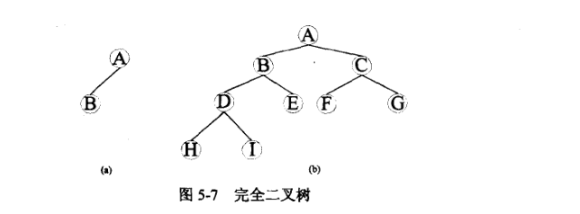

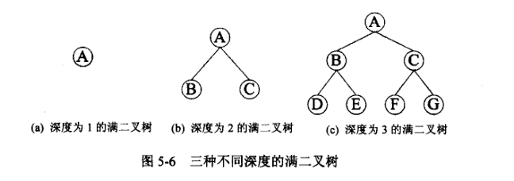


## 3、二叉树存储结构

### 1>顺序存储

*   顺序存储指：不管给定的二叉树是不是完全二叉树，都看作完全二叉树，即按完全二叉树的层次次序（从上到下，从左到右）把各个结点依次存入数组中

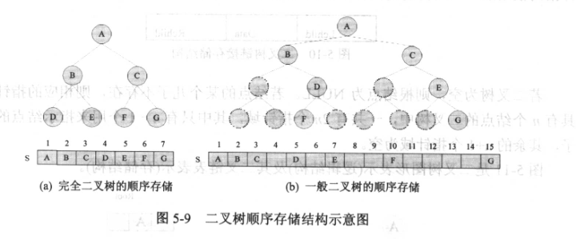

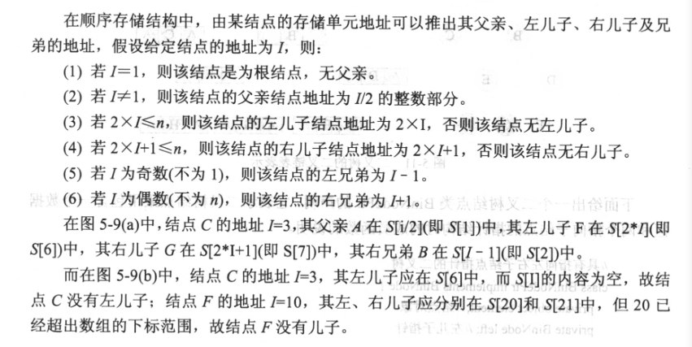

### 2> 链式存储

链式存储中，每个节点由数据员和三个指针组成，即链表结构 在加一个 尾指针

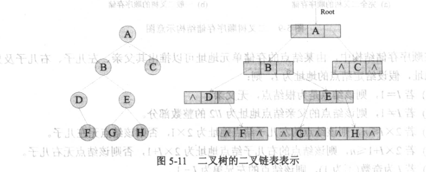


## 4、遍历树

遍历树四种基本的遍历思想为：

前序遍历：根结点 ---> 左子树 ---> 右子树

中序遍历：左子树---> 根结点 ---> 右子树

后序遍历：左子树 ---> 右子树 ---> 根结点

层次遍历：仅仅需按层次遍历就可以

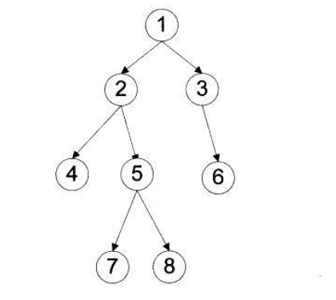

前序遍历：1  2  4  5  7  8  3  6

中序遍历：4  2  7  5  8  1  3  6

后序遍历：4  7  8  5  2  6  3  1

层次遍历：1  2  3  4  5  6  7  8


**代码实现**

```java
//采用递归方式：---->>>>>>>>>>>>>
//前序遍历
public void preOrderTraverse1(TreeNode root) {  
        if (root != null) {  
            System.out.print(root.val+"  ");  
            preOrderTraverse1(root.left);  
            preOrderTraverse1(root.right);  
        }  
}

//中序遍历
public void inOrderTraverse1(TreeNode root) {  
        if (root != null) {  
            inOrderTraverse1(root.left);  
            System.out.print(root.val+"  ");  
            inOrderTraverse1(root.right);  
        }  
} 
//后续遍历
public void postOrderTraverse1(TreeNode root) {  
        if (root != null) {  
            postOrderTraverse1(root.left);  
            postOrderTraverse1(root.right);  
            System.out.print(root.val+"  ");  
        }  
} 


//层次遍历
public void levelTraverse(TreeNode root) {  
        if (root == null) {  
            return;  
        }  
        LinkedList<TreeNode> queue = new LinkedList<>();  
        queue.offer(root);  
        while (!queue.isEmpty()) {  
            TreeNode node = queue.poll();  
            System.out.print(node.val+"  ");  
            if (node.left != null) {  
                queue.offer(node.left);  
            }  
            if (node.right != null) {  
                queue.offer(node.right);  
            }  
        }  
} 
```

## 5、平衡二叉树


平衡二叉树：又称AVL树；

*   左子树和右子树都是平衡二叉树
*   左子树和右子树的深度（高度）之差的绝对值不超过1。
*   常用实现方法有 **红黑树**、AVL、替罪羊树、Treap、伸展树

AVL树同二叉排序树一样，有遍历（先序、中序、后序），最大值与最小值，插入和删除，销毁二叉树等操作，除插入和删除与二叉排序树操作不同之外，其余均与二叉排序树相同


## 6、红黑树

红黑树（Red Black Tree） 是一种自平衡二叉查找树

红黑树和AVL树类似，都是在进行插入和删除操作时通过特定操作保持二叉查找树的平衡，从而获得较高的查找性能。

它可以在O(log n)时间内做查找，插入和删除，这里的n 是树中元素的数目。

**特性：**

*   红黑树是每个节点都带有颜色属性的二叉查找树，颜色或红色或黑色。

*   性质1. 节点是红色或黑色。

*   性质2. 根节点是黑色。

*   性质3 每个红色节点的两个子节点都是黑色。(**从每个叶子到根的所有路径上不能有两个连续的红色节点**)

*   性质4. 从任一节点到其每个叶子的所有路径都包含相同数目的黑色节点。

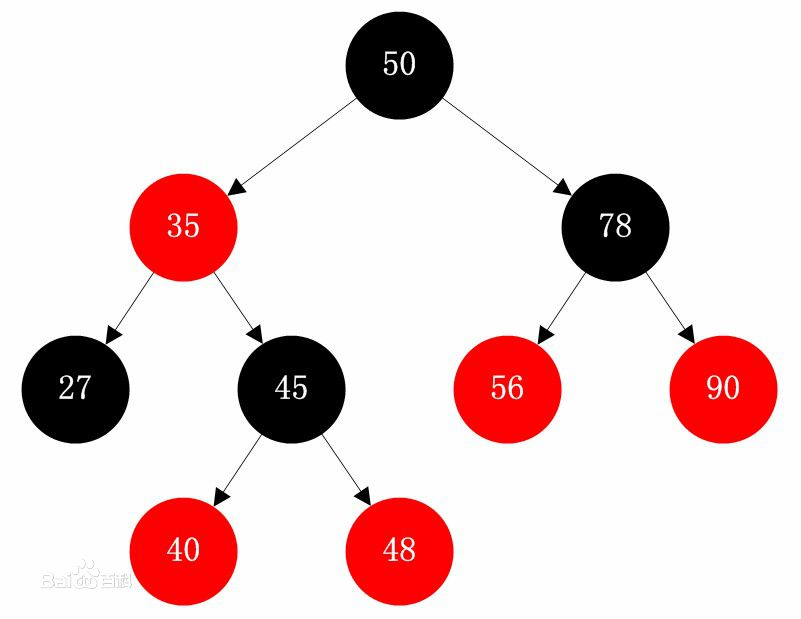


## 7、B-tree


（-------正在建设中，敬请期待！------）


# 七、图

（-------正在建设中，敬请期待！------）

# 八、堆

（-------正在建设中，敬请期待！------）

# 九、散列表

（-------正在建设中，敬请期待！------）


# 资料参考

*   算法：第4版 
*   数据结构与算法分析(Java版)
*   [队列详解及java实现](https://www.cnblogs.com/fzz9/p/8159679.html)
*   [从B树、B+树、B*树谈到R 树](https://blog.csdn.net/v_JULY_v/article/details/6530142)