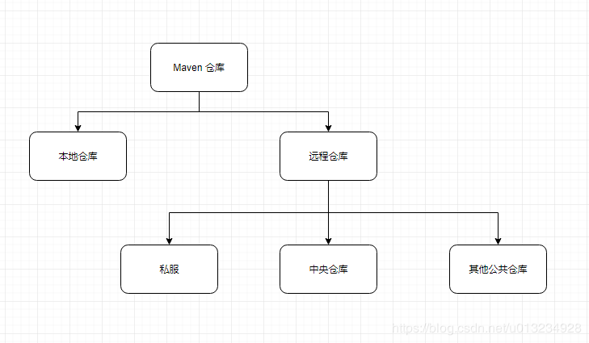

# Maven 

是优秀的构建工具，能够帮我们自动化构建过程，从清理、编译、测试到生成报告，在到打包和部署。

是依赖管理工具和项目信息管理工具，它提供中央仓库，能帮我们自动下载构件。

# Maven 基础概念

groupId、artifactId、version 这3个元素定义了一个项目基本坐标。

* groupId：定义了项目属于哪个组，这个组往往和项目所在的组织或公司存在关联

* artifactId：定义了当前Maven项目在组中唯一的ID

* version ：定了项目当前的版本
* scope：依赖范围，告诉Maven这个依赖项资源使用的范围:
  * compile ，默认，表明是所有任务所需的资源
  * test：测试有效。运行所有的测试用例时所需资源
  * provided：JDK部分或应用服务器的classpath所需的资源
  * runtime：运行时依赖范围，表明是运行时所需资源
  * system：系统依赖范围，和provided一致，但需要使用systemPath显式的指定依赖文件路径
  * import：导入依赖
* type，定义打包的类型
* optional： 是否为可选依赖
* exclusions：用来排除传递性依赖

还有以下常用标签：

- Dependency：依赖
- Plug-in：maven的插件集合
- Repository：仓库，即放置Artifact的地方

# Maven打包常用命令

> mvn compile：编译命令(只编译主代码，主代码放在src/main/java/目录下)。会在你的项目路径下生成一个target目录，在该目录中包含一个classes文件夹，里面全是生成的class文件及字节码文件
>
> mvn test：运行应用程序中的单元测试
>
> mvn package：依据项目路径下一个target目录生成jar/war文件,
>
> mvn install：该命令包含了package命令功能，并将项目的jar文件添加到库中, 以备依赖此项目时使用
>
> mvn site：生成项目相关信息的网站
>
> mvn clean：删除项目路径下的target文件，但是不会删除本地的maven仓库已经生成的jar文件

# 仓库

仓库分两类：本地仓库和远程仓库；当maven通过坐标查找构件时，优先查看本地仓库，如果没有在查看远程仓库，在没有maven就会报错。

本地仓库：一般默认在 C:\Users\（电脑名）\ .m2\repository ，可通过setting文件配置

中央仓库：默认的远程仓库

私服：架设在局域网内的仓库服务

## 问题

如何解决版本冲突？

通过添加标签来解决冲突，找到两个jar包，留下高版本的jar包，去掉低版本的jar包。

# DepencyManagement

通常在多模块项目中用来指定**公共依赖的版本号、scope的控制**，让子项目中引用一个依赖而不用显示的列出版本号。Maven会沿着父子层次向上走，直到找到一个拥有dependencyManagement元素的项目，然后它就会使用在这个dependencyManagement元素中指定的版本号。

**与Dependencies区别**

相对于dependencyManagement，所有生命在dependencies里的依赖都会自动引入

 **dependencies ** 即使在子项目中不写该依赖项，那么子项目仍然会从父项目中继承该依赖项（全部继承）

**dependencyManagement里只是声明依赖，并不实现引入**，因此子项目需要显示的声明需要用的依赖。如果不在子项目中声明依赖，是不会从父项目中继承下来的；只有在子项目中写了该依赖项，并且没有指定具体版本，才会从父项目中继承该项，并且version和scope都读取自父pom;另外如果子项目中指定了版本号，那么会使用子项目中指定的jar版本。