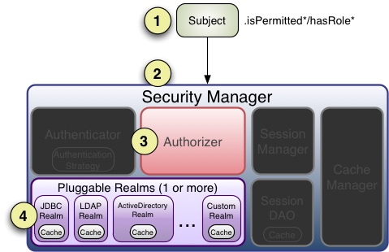
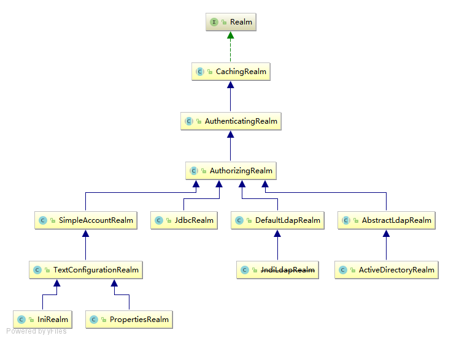
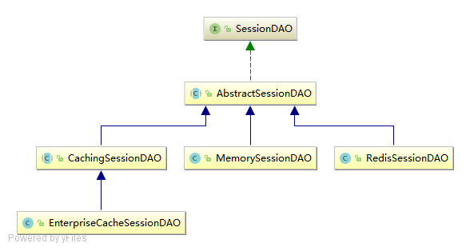

# Shiro 原理与实践

# 一、认识 Shiro

## 1、Shiro 的作用

Shiro 可以帮助我们完成：

* **认证、授权、加密、会话管理**

- 启用单点登录（SSO）功能
- 无需登录即可为用户关联启用“记住我”服务
- 与 Web 集成、缓存等。


## 2、Shiro 功能模块

**“应用程序安全的四大基石” - 身份验证，授权，会话管理和加密**：

* **Authentication**：身份认证/登录，验证用户是不是拥有相应的身份；

* **Authorization**：授权，即权限验证，验证某个已认证的用户是否拥有某个权限；即判断用户是否能做事情，常见的如：验证某个用户是否拥有某个角色。或者细粒度的验证某个用户对某个资源是否具有某个权限；

* **Session Manager**：会话管理，即用户登录后就是一次会话，在没有退出之前，它的所有信息都在会话中；会话可以是普通JavaSE环境的，也可以是如Web环境的；

* **Cryptography**：加密，保护数据的安全性，如密码加密存储到数据库，而不是明文存储；

额外的辅助功能支持和强化：

* *Web Support*：Web支持，可以非常容易的集成到Web环境；

* *Caching*：缓存，比如用户登录后，其用户信息、拥有的角色/权限不必每次去查，这样可以提高效率；

* *Concurrency*：shiro支持多线程应用的并发验证，即如在一个线程中开启另一个线程，能把权限自动传播过去；

* *Testing*：提供测试支持；

* *Run As*：允许一个用户假装为另一个用户（如果他们允许）的身份进行访问；

* *Remember Me*：记住我，这个是非常常见的功能，即一次登录后，下次再来的话不用登录了


## 3、Shiro 组件元素


**Subject**：主体，可以看到主体可以是任何可以与应用交互的“用户”；

**SecurityManager**：**安全管理器，Shiro的核心**；管理着所有Subject、且负责进行认证和授权、及会话、缓存的管理。相当于SpringMVC中的`DispatcherServlet`或者Struts2中的`FilterDispatcher`；所有具体的交互都通过SecurityManager进行控制；

**Realm**：可以有1个或多个Realm，Shiro 从从 Realm 获取安全数据（如用户、角色、权限），就是说SecurityManager要验证用户身份，那么它需要从 Realm 获取相应的用户进行比较以确定用户身份是否合法；需要从 Realm 得到用户相应的角色/权限进行验证用户是否能进行操作；可以把 Realm 看成 DataSource，即安全数据源。 

**Authenticator**：认证器，负责主体认证的，可自定义实现认证策略（Authentication Strategy）

**Authrizer**：授权器，或者访问控制器，用来决定主体是否有权限进行相应的操作；即控制着用户能访问应用中的哪些功能；

**SessionManager**：session 管理中心；

**SessionDAO**：DAO大家都用过，数据访问对象，用于会话的CRUD，比如我们想把Session保存到数据库，那么可以实现自己的SessionDAO，通过如JDBC写到数据库；比如想把Session放到Memcached中，可以实现自己的Memcached SessionDAO；另外SessionDAO中可以使用Cache进行缓存，以提高性能；

**CacheManager**：缓存控制器，来管理如用户、角色、权限等的缓存的；因为这些数据基本上很少去改变，放到缓存中后可以提高访问的性能

**Cryptography**：密码模块，Shiro提高了一些常见的加密组件用于如密码加密/解密的。


# 二、认证过程

使用 shiro 进行 用户身份验证的过程一般分三个步骤：

1. Collect the Subject’s submitted principals and credentials（收集用户身份凭据，如用户名/密码）
2. Submit the principals and credentials for authentication.（提交凭据进行认证）
3. If the submission is successful, allow access, otherwise retry authentication or block access.（如果认证成功，则允许访问，否则不允许）

```java
public static void main(String[] args) {
    // 先准备一些用户身份/凭据， 一般这些凭据都是通过数据库存储的
    Ini ini = new Ini();
    ini.setSectionProperty("users","zhang","123");
    Factory<SecurityManager> factory = new IniSecurityManagerFactory(ini);
    SecurityManager securityManager = factory.getInstance();
    SecurityUtils.setSecurityManager(securityManager);


    //1、 收集凭据
    UsernamePasswordToken token = new UsernamePasswordToken("zhang", "123");
    //2、 获取当前正在执行的用户
    Subject subject = SecurityUtils.getSubject();

    try {
        // 3、身份认证
        subject.login(token);
        System.out.println("---------------身份验证通过-------------");
    } catch (Exception e) {
        // 身份认证失败处理
        System.out.println("认证失败");
    }

    // 退出
    subject.logout();
}
```


Shiro 框架具体认证过程如下：


流程如下：
1、首先调用 `Subject.login(token)`进行登录，其会自动委托给 `SecurityManager`，调用之前必须通过 `SecurityUtils. setSecurityManager()`设置；

2、`SecurityManager` 负责真正的身份验证逻辑；它会委托给 `Authenticator` 进行身份验证；

3、`Authenticator` 才是真正的身份验证者，ShiroAPI 中核心的身份认证入口点，此处可以自定义插入自己的实现；

4、`Authenticator` 可能会委托给相应的 `AuthenticationStrategy` 进行多 Realm 身份验证。默认ModularRealmAuthenticator 会调用 AuthenticationStrategy 进行多 Realm 身份验证；

5、`Authenticator` 会把相应的 token 传入 `Realm`，从 Realm 获取身份验证信息，如果没有返回/抛出异常表示身份验证失败了。此处可以配置多个 `Realm`，将按照相应的顺序及策略进行访问。


# 三、授权过程



流程如下：
1、首先调用 `Subject.isPermitted/hasRole`接口，其会委托给 SecurityManager，而SecurityManager 接着会委托给 Authorizer；

2、`Authorizer` 是真正的授权者，如果我们调用如 isPermitted(“user:view”)，其首先会通过PermissionResolver 把字符串转换成相应的 Permission 实例；

3、在进行授权之前，其会调用相应的 Realm 获取 Subject 相应的角色/权限用于匹配传入的角色/权限；

4、Authorizer 会判断 Realm 的角色/权限是否和传入的匹配，如果有多个 Realm，会委托给`ModularRealmAuthorizer` 进行循环判断，如果匹配如 isPermitted*/hasRole*会返回 true，否则返回 false 表示授权失败。


Shiro `SecurityManager`实现默认使用[`ModularRealmAuthorizer`](http://shiro.apache.org/static/current/apidocs/org/apache/shiro/authz/ModularRealmAuthorizer.html)实例；对于任何授权操作，`ModularRealmAuthorizer`将迭代其内部集合`Realms`并以迭代顺序与每个集合进行交互。每个`Realm`交互功能如下：

1. 如果`Realm`自身实现[`Authorizer`](http://shiro.apache.org/static/current/apidocs/org/apache/shiro/authz/Authorizer.html)接口，其各自的`Authorizer`方法（`hasRole*`，`checkRole*`，`isPermitted*`，或`checkPermission*`）被调用。
2. 如果Realm没有实现`Authorizer`接口，则忽略它。


# 四、Ream

## 1、重写 Ream




如上图所示：继承`AuthorizingRealm`即可，

```java
public class ShiroRealm extends AuthorizingRealm {
    @Autowired
    private UserService userService;

    /**
     * 获取授权信息
     * @param principalCollection
     * @return
     */
    @Override
    protected AuthorizationInfo doGetAuthorizationInfo(PrincipalCollection principalCollection) {
        // 实例化授权对象
        SimpleAuthorizationInfo simpleAuthorizationInfo = new SimpleAuthorizationInfo();

        //获取登录用户名
        String username= (String) principalCollection.getPrimaryPrincipal();
        //查询用户信息
        UserDo userDo = userService.findUserByName(username);

        // 查询用户角色
        for (UserRole role: userDo.getRoles()) {
            //添加角色
            simpleAuthorizationInfo.addRole(role.getRoleName());
            for (Permission permission: role.getPermissions()) {
                //添加权限
                simpleAuthorizationInfo.addStringPermission(permission.getPermission());
            }
        }
        return simpleAuthorizationInfo;
    }

    /**
     * 获取身份验证信息
     * @param authenticationToken
     * @return
     * @throws AuthenticationException
     */
    @Override
    protected AuthenticationInfo doGetAuthenticationInfo(AuthenticationToken authenticationToken) throws AuthenticationException {
        //加这一步的目的是在Post请求的时候会先进认证，然后在到请求
        if (authenticationToken.getPrincipal() == null) {
            return null;
        }
        String username = (String)authenticationToken.getPrincipal();
        UserDo userDo = userService.findByUsername(username);
        if(userDo == null) {
            throw new UnknownAccountException();//没找到帐号
        }
        if(Boolean.TRUE.equals(userDo.getLocked())) {
            throw new LockedAccountException(); //帐号锁定
        }
        //交给 AuthenticatingRealm 使用 CredentialsMatcher 进行密码匹配，如果觉得人家的不好可以在此判断或自定义实现
        SimpleAuthenticationInfo authenticationInfo = new SimpleAuthenticationInfo(
                userDo.getUsername(), //用户名
                userDo.getPassword(), //密码
                ByteSource.Util.bytes(userDo.getCredentialsSalt()),//salt = username + salt
                getName() //realm name
        );
        return authenticationInfo;
    }
}
```

## 2、加密

在org.apache.shiro.crypto.hash包中，提供了一些列的Md2,Md5,Sha256等等的散列算法相关的操作

可以在申明 Ream 时设置

```java
/**
     * realm实现身份认证Realm，，继承自AuthorizingRealm，此处的注入不可以缺少。否则会在UserRealm中注入对象会报空指针.
     *
     * @return
     */
@Bean
public ShiroRealm myShiroRealm() {
    ShiroRealm shiroRealm = new ShiroRealm();
    shiroRealm.setCachingEnabled(true);
    //启用身份验证缓存，即缓存AuthenticationInfo信息，默认false
    shiroRealm.setAuthenticationCachingEnabled(true);
    //缓存AuthenticationInfo信息的缓存名称 在ehcache-shiro.xml中有对应缓存的配置
    //        shiroRealm.setAuthenticationCacheName("authenticationCache");
    //启用授权缓存，即缓存AuthorizationInfo信息，默认false
    shiroRealm.setAuthorizationCachingEnabled(true);
    //缓存AuthorizationInfo信息的缓存名称  在ehcache-shiro.xml中有对应缓存的配置
    //        shiroRealm.setAuthorizationCacheName("authorizationCache");
    // 加密处理
    //        shiroRealm.setCredentialsMatcher(hashedCredentialsMatcher());
    return shiroRealm;
}

```


# 五、会话管理


由上图可以看出，Shiro 的核心组件，顶层组件 `SecurityManager` 直接继承了 SessionManager；

而Shiro中 组件 `SessionManager` 有三个默认的实现类：

* **DefaultSessionManager**：DefaultSecurityManager 使用的默认实现，用于 JavaSE 环境；

* **ServletContainerSessionManager**：DefaultWebSecurityManager 使用的默认实现，用于 Web环境，其直接使用 Servlet 容器的会话；
* **DefaultWebSessionManager** ： 用 于 Web 环境的实 现 ， 可 以 替 代ServletContainerSessionManager，自己维护着会话，直接废弃了 Servlet 容器的会话管理。

一般情况，我们使用 `DefaultWebSessionManager`


## 1、使用会话

通过与当前的`Subject`来获取`Session`

```java
Subject currentUser = SecurityUtils.getSubject();

Session session = currentUser.getSession();
session.setAttribute( "someKey", someValue);
```

该`currentUser.getSession()`方法是调用的快捷方式`currentUser.getSession(true)`。

对于那些熟悉`HttpServletRequest`API的人来说，该`Subject.getSession(boolean create)`方法的功能

与方法相同`HttpServletRequest.getSession(boolean create)`：

- 如果`Subject`已经有a `Session`，则忽略boolean参数并`Session`立即返回
- 如果`Subject`还没有a `Session`和`create`boolean参数`true`，则会创建并返回一个新会话。
- 如果`Subject`还没有a `Session`和`create`boolean参数`false`，则不会创建新会话并`null`返回。


## 2、会话超时

默认情况下，Shiro的`SessionManager`实现默认为30分钟的会话超时

可通过如下方式设置，`globalSessionTimeout`，值是以**毫秒**

```
//设置session有效时间为10分钟
SecurityUtils.getSubject().getSession().setTimeout(600000);
```


## 3、会话监听器

会话监听器用于监听会话创建、过期及停止事件：

```java
public class MySessionListener1 implements SessionListener { 
    @Override 
    public void onStart(Session session) {//会话创建时触发
        System.out.println("会话创建：" + session.getId()); 
    } 
    @Override 
    public void onExpiration(Session session) {//会话过期时触发
        System.out.println("会话过期：" + session.getId()); 
    } 
    @Override 
    public void onStop(Session session) {//退出/会话过期时触发
        System.out.println("会话停止：" + session.getId()); 
    } 
}
```

如果只想监听某一个事件，可以继承 SessionListenerAdapter 实现


## 4、会话DAO

Shiro 提供 SessionDAO 用于会话的 CRUD，即 DAO（Data Access Object）模式实现：

如 DefaultSessionManager 在创建完 session 后会调用该方法；

如保存到关系数据库/文件系统/NoSQL 数据库；即可以实现会话的持久化；返回会话 ID；

主要此处返回的ID.equals(session.getId())；

```java
Serializable create(Session session); 
//根据会话 ID 获取会话
Session readSession(Serializable sessionId) throws UnknownSessionException; 
//更新会话；如更新会话最后访问时间/停止会话/设置超时时间/设置移除属性等会调用
void update(Session session) throws UnknownSessionException; 
//删除会话；当会话过期/会话停止（如用户退出时）会调用
void delete(Session session); 
//获取当前所有活跃用户，如果用户量多此方法影响性能
```



**AbstractSessionDAO**提供了SessionDAO的基础实现，如生成会话ID等；

**CachingSessionDAO**提供了对开发者透明的会话缓存的功能，只需要设置相应的 CacheManager 即可；

**MemorySessionDAO** 直接在内存中进行会话维护；

**EnterpriseCacheSessionDAO** 提供了缓存功能的会话维护，默认情况下使用 MapCache 实现，内部使用 ConcurrentHashMap 保存缓存的会话

**RedisSessionDAO**提供了Redis的会话缓存功能

# 六、web过滤器

运行Web应用程序时，Shiro将创建一些有用的默认`Filter`实例，并`[main]`自动在该部分中使用它们。

<<<<<<< HEAD
# 安全管理

```java
@Bean
public ShiroFilterFactoryBean shiroFilter(SecurityManager securityManager) {
    ShiroFilterFactoryBean shiroFilterFactoryBean = new ShiroFilterFactoryBean();
    shiroFilterFactoryBean.setSecurityManager(securityManager);
    // 没有登陆的用户只能访问登陆页面
    shiroFilterFactoryBean.setLoginUrl("/auth/login");
    // 登录成功后要跳转的链接
    shiroFilterFactoryBean.setSuccessUrl("/auth/index");
    // 未授权界面;
    shiroFilterFactoryBean.setUnauthorizedUrl("/auth/error");
    //自定义拦截器
    Map<String, Filter> filtersMap = new LinkedHashMap<>();
    //限制同一帐号同时在线的个数。
    filtersMap.put("kickout", kickoutSessionControlFilter());
    shiroFilterFactoryBean.setFilters(filtersMap);
    // 权限控制map.
    Map<String, String> filterChainDefinitionMap = new LinkedHashMap<String, String>();

    filterChainDefinitionMap.put("/auth/logout", "logout");
    filterChainDefinitionMap.put("/auth/kickout", "anon");
    filterChainDefinitionMap.put("/**", "authc");
    shiroFilterFactoryBean.setFilterChainDefinitionMap(filterChainDefinitionMap);
    return shiroFilterFactoryBean;
}
```

shiro过滤器过滤属性含义

*   **securityManager**：这个属性是必须的。

*   **loginUrl** ：没有登录的用户请求需要登录的页面时自动跳转到登录页面，不是必须的属性，不输入地址的话会自动寻找项目web项目的根目录下的”/login.jsp”页面。

*   **successUrl** ：登录成功默认跳转页面，不配置则跳转至”/”。如果登陆前点击的一个需要登录的页面，则在登录自动跳转到那个需要登录的页面。不跳转到此。

*   **unauthorizedUrl** ：没有权限默认跳转的页面

 

**其权限过滤器及配置释义**

*   anon ：匿名使用
*   authc ：需要认证(登录)才能使用
*   user ：必须存在用户，当登入操作时不做检查
*   ssl ：表示安全的url请求，协议为https
*   rest ：其中请求方式为post，get，delete等
*   roles
*   perms
*   port
*   authcBasic ：表示httpBasic认证

```
anon:例子/admins/**=anon 没有参数，表示可以匿名使用。
authc:例如/admins/user/**=authc表示需要认证(登录)才能使用，没有参数
roles(角色)：例子/admins/user/=roles[admin],参数可以写多个，多个时必须加上引号，并且参数之间用逗号分割，当有多个参数时，例如admins/user/=roles["admin,guest"],每个参数通过才算通过，相当于hasAllRoles()方法。
perms（权限）：例子/admins/user/=perms[user:add:*],参数可以写多个，多个时必须加上引号，并且参数之间用逗号分割，例如/admins/user/=perms["user:add:,user:modify:"]，当有多个参数时必须每个参数都通过才通过，想当于isPermitedAll()方法。
rest：例子/admins/user/=rest[user],根据请求的方法，相当于/admins/user/=perms[user:method] ,其中method为post，get，delete等。
port：例子/admins/user/**=port[8081],当请求的url的端口不是8081是跳转到schemal://serverName:8081?queryString,其中schmal是协议http或https等，serverName是你访问的host,8081是url配置里port的端口，queryString是你访问的url里的？后面的参数。
authcBasic：例如/admins/user/**=authcBasic没有参数表示httpBasic认证
ssl:例子/admins/user/**=ssl没有参数，表示安全的url请求，协议为https
user:例如/admins/user/**=user没有参数表示必须存在用户，当登入操作时不做检查
```


```java
public enum DefaultFilter {
    //不需要登录就能访问,一般用于静态资源,或者移动端接口
    anon(AnonymousFilter.class), 
    //需要登录认证才能访问的资源
    authc(FormAuthenticationFilter.class),
    //Http身份验证拦截器,非常用类型
    authcBasic(BasicHttpAuthenticationFilter.class),
    //用户登出拦截器,主要属性:redirectURL退出登录后重定向的地址
    logout(LogoutFilter.class), 
    noSessionCreation(NoSessionCreationFilter.class),//不创建会话拦截过滤
    //验证用户是否拥有资源权限，如：perms["user:add:*,user:modify:*"]
    perms(PermissionsAuthorizationFilter.class),
    //端口号过滤,如 port(80) 如果用户访问该页面是非 80，将自动将请求端口改为 80 并重定向到该 80 端口
    port(PortFilter.class),
    // rest 风格拦截器
    rest(HttpMethodPermissionFilter.class),
    //具备相应角色才能使用，如：roles["admin,guest"]
    roles(RolesAuthorizationFilter.class),
    //表示安全的url请求，协议为https
    ssl(SslFilter.class),
    //必须存在用户，当登入操作时不做检查
    user(UserFilter.class);
}
```

这些过滤器分为两组，一组是认证过滤器，一组是授权过滤器。

* 认证过滤器：anon，authcBasic，auchc，user

* 授权过滤器：perms，roles，ssl，rest，port


**拦截器的通配符的写法**

```java
?：匹配一个字符
*：匹配零个或多个字符
**：匹配零个或多个路径
```


# 七、权限注解

* `@RequiresAuthentication`：要求在访问或调用被注解的类/实例/方法时，Subject在当前的session中已经被验证
* `@RequiresGuest`：要求当前Subject是一个“访客”，也就是，在访问或调用被注解的类/实例/方法时，他们没有被认证或者在被前一个Session记住
* `@RequiresPermissions("account:create")`：要求当前Subject在执行被注解的方法时具备一个或多个对应的权限
* `@RequiresRoles("administrator")`：当前Subject必须拥有所有指定的角色才能访问。如果Subject没有拥有所有指定角色，则方法不会执行还会抛出AuthorizationException异常。
* `@RequiresUser`：当前Subject必须是应用的用户，才能访问或调用被该注解标注的类，实例，方法

使用方法：
Shiro的认证注解处理是有内定的处理顺序的，如果有个多个注解的话，前面的通过了会继续检查后面的，若不通过则直接返回，处理顺序依次为（与实际声明顺序无关）：

```java
RequiresRoles 
RequiresPermissions 
RequiresAuthentication 
RequiresUser 
RequiresGuest
```


# 八、Springboot整合

实现 shiro 功能，一般有以下步骤：

1. 自定义Realm 实现，继承自AuthorizingRealm

2. 定义配置类，springboot 采用注解方式，一般会配置如下功能

   1. 将Realm 实现加入到容器

   2. Shiro的安全管理器

   3. Shiro的Web过滤器

   4. Shiro的安全管理器

   5. Shiro的会话管理器

      **以上是必须配置项，以下可考虑是否配置，非强制**

   6. 加密处理


## 1、Realm 实现

```java
/**
 * 用户认证
 */
public class ShiroRealm  extends AuthorizingRealm {
    @Autowired
    ISysUserService sysUserService;

    @Autowired
    ISysRoleService sysRoleService;

    /**
     * 授权：验证权限时调用
     * @param principalCollection
     * @return
     */
    @Override
    protected AuthorizationInfo doGetAuthorizationInfo(PrincipalCollection principalCollection) {
        //获取登录用户名
        String name= (String) principalCollection.getPrimaryPrincipal();
        //查询用户名称
        SysUser user = sysUserService.findUserByName(name);
        //添加角色和权限
        SimpleAuthorizationInfo simpleAuthorizationInfo = new SimpleAuthorizationInfo();

        // 查询用户角色
        List<SysRole> list = sysRoleService.findRoleByUserId(user.getSysUserId());
        for (SysRole role: list) {
            //添加角色
            simpleAuthorizationInfo.addRole(role.getRoleName());
//            for (Permission permission: role.getPermissions()) {
//                //添加权限
//                simpleAuthorizationInfo.addStringPermission(permission.getPermission());
//            }
        }
        return simpleAuthorizationInfo;
    }

    /**
     * 认证：登录时调用
     * @param authenticationToken
     * @return
     * @throws AuthenticationException
     */
    @Override
    protected AuthenticationInfo doGetAuthenticationInfo(AuthenticationToken authenticationToken) throws AuthenticationException {
        String username = (String) authenticationToken.getPrincipal();
        String password = new String((char[]) authenticationToken.getCredentials());
        // 查询用户信息
        SysUser sysUser = sysUserService.findUserByName(username);

        if (null == sysUser) {
            throw new UnknownAccountException();
        }
        if (!sysUser.getPassword().equals(password)) {
            throw new IncorrectCredentialsException();
        }
//        if (sysUser.getLocked() == 1) {
//            throw new LockedAccountException();
//        }

        return new SimpleAuthenticationInfo(username, password, getName());
    }
}
```

## 2、定义Shiro配置

### 基本配置项目

```java
@Configuration
public class ShiroConfiguration {
    private final int SESSION_TIMEOUT= 180;// Session 超时失效时间，秒
    private final int COOKIE_TIMEOUT = 180;// Cookie 超时失效时间，秒

    /**
     * realm实现，继承自AuthorizingRealm
     * @return
     */
    @Bean
    public ShiroRealm myShiroRealm() {
        ShiroRealm shiroRealm = new ShiroRealm();
        // 加密处理
//        shiroRealm.setCredentialsMatcher(hashedCredentialsMatcher());
        return shiroRealm;
    }
    /**
     * 权限管理，主要是配置Realm的管理认证、session 会话管理、缓存管理等
     * @return
     */
    @Bean
    public SecurityManager securityManager() {
        DefaultWebSecurityManager securityManager = new DefaultWebSecurityManager();
        securityManager.setRealm(myShiroRealm());
        securityManager.setSessionManager(sessionManager());
        // 自定义缓存实现
//        securityManager.setCacheManager(ehCacheManager());
        return securityManager;
    }
    
    /**
     * Shiro session管理，主要配置sessionDAO，SessionListeners、SessionIdCookie
     */
    @Bean
    public DefaultWebSessionManager sessionManager() {
        DefaultWebSessionManager sessionManager = new DefaultWebSessionManager();
        sessionManager.setGlobalSessionTimeout(SESSION_TIMEOUT);
        //设置sessionDao对session查询，在查询在线用户service中用到了
//        sessionManager.setSessionDAO(sessionDAO());

        //配置session的监听
//        Collection<SessionListener> listeners = new ArrayList<>();
//        listeners.add(new ShiroSessionListener());
//        sessionManager.setSessionListeners(listeners);

        //设置在cookie中的sessionId名称
//        sessionManager.setSessionIdCookie(simpleCookie());
        return sessionManager;
    }
    
}
```

### 会话监听器

会话监听器用于监听会话创建、过期及停止事件：

```java
public class ShiroSessionListener implements SessionListener {
    private static final Logger LOGGER = LoggerFactory.getLogger(UpmsSessionListener.class);

    @Override
    public void onStart(Session session) {
        LOGGER.debug("会话创建：" + session.getId());
    }

    @Override
    public void onStop(Session session) {
        LOGGER.debug("会话停止：" + session.getId());
    }

    @Override
    public void onExpiration(Session session) {
        LOGGER.debug("会话过期：" + session.getId());
    }
}

```


### 会话Cookie 模板

```java
/**
     * 会话Cookie模板
     * @return
     */
    @Bean
    public SimpleCookie simpleCookie(){
        SimpleCookie simpleCookie = new SimpleCookie();
        simpleCookie.setHttpOnly(true);//不会暴露给客户端
        simpleCookie.setMaxAge(COOKIE_TIMEOUT);//设置Cookie的过期时间，秒为单位
        simpleCookie.setName("ycxc.admin.session.id");
        return simpleCookie;
    }
```


### 会话DAO

使用`RedisSessionDAO`需要 shiro-redis 插件支持

```xml
<dependency>
    <groupId>org.crazycake</groupId>
    <artifactId>shiro-redis</artifactId>
    <version>3.2.3</version>
</dependency>
```

```java
/**
     * RedisSessionDAO shiro sessionDao层的实现 通过redis
     * <p>
     * 使用的是shiro-redis开源插件
     */
    @Bean
    public RedisSessionDAO redisSessionDAO() {
        RedisSessionDAO redisSessionDAO = new RedisSessionDAO();
        redisSessionDAO.setRedisManager( redisManager());
        redisSessionDAO.setExpire(tomcatTimeout);
        redisSessionDAO.setSessionIdGenerator( new JavaUuidSessionIdGenerator()); //  Session ID 生成器
        return redisSessionDAO;
    }

/**
     * 配置shiro redisManager
     * <p>
     * 使用的是shiro-redis开源插件
     *
     * @return
     */
    public RedisManager redisManager() {
        RedisManager redisManager = new RedisManager();
        redisManager.setHost(host + ":" + port);
        redisManager.setTimeout(timeout);
        redisManager.setPassword(password);
        return redisManager;
    }

```


### 加密策略

```java
/**
 * 加密策略
 *
 * @return
 */
@Bean
public HashedCredentialsMatcher hashedCredentialsMatcher() {
    HashedCredentialsMatcher credentialsMatcher = new HashedCredentialsMatcher();
    // 指定加密方式为MD5
    credentialsMatcher.setHashAlgorithmName("MD5");
    // 加密次数
    credentialsMatcher.setHashIterations(1);
    credentialsMatcher.setStoredCredentialsHexEncoded(true);
    return credentialsMatcher;
}
```


可以在 Realm 实现的bean 中注入，如：

```java
/**
     * realm实现，继承自AuthorizingRealm
     * @return
     */
    @Bean
    public ShiroRealm myShiroRealm() {
        ShiroRealm shiroRealm = new ShiroRealm();
        // 加密处理
        shiroRealm.setCredentialsMatcher(hashedCredentialsMatcher());
        return shiroRealm;
    }
```

