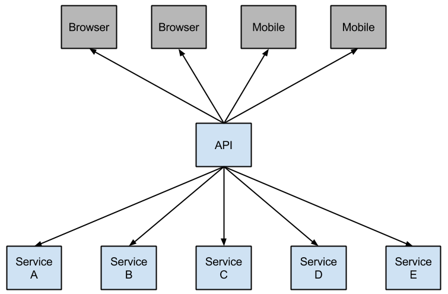

# 断路器：Hystrix客户端

Netflix创建了一个名为[Hystrix](https://github.com/Netflix/Hystrix)的库，该库实现了[断路器模式](https://martinfowler.com/bliki/CircuitBreaker.html)。在微服务架构中，通常有多个服务调用层。



较低级别的服务中的服务故障可能会导致级联故障，直至用户。

> 当在由（默认值：10秒）定义的滚动窗口中，对特定服务的调用超过`circuitBreaker.requestVolumeThreshold`（默认值：20个请求）并且失败百分比大于`circuitBreaker.errorThresholdPercentage`（默认值：> 50％）时`metrics.rollingStats.timeInMilliseconds`，电路断开并且不会进行调用。

在错误和断路的情况下，开发人员可以提供后备功能。


开路可以停止级联故障，并让不堪重负的服务故障时间得以恢复。回退可以是另一个受Hystrix保护的调用，静态数据或合理的空值。可以将回退链接在一起，以便第一个回退进行其他业务调用，而后者又回退到静态数据。


# 熔断器

熔断器通俗的讲，就如同电力过载保护装置（配电箱）一般，起到一个电力短路过载，跳闸的作用。

在高并发的情况下，当某个服务的单个点请求故障导致用户的请求出于阻塞状态，最终整个服务的线程资源耗尽。由于服务的依赖性，这个服务的故障导致那些依赖该服务的其他服务也出现故障。进而导致出现大量的级联故障，最终整个系统崩溃。这现象就叫**雪崩效应**。

而熔断器能有效的阻止分布式系统中出现的联动故障。通过隔离服务的访问阻止联动故障，并提供解决方案。

熔断器就是保护服务高可用的最后一道防线。


## 设计原则

总的来说， Hystrix 的设计原则如下。 

* 防止单个服务的故障耗尽整个服务的 Servlet 容器（例如 Tomcat ）的线程资源。 

* 快速失败机制，如果某个服务出现了故障，则调用该服务的请求快速失败，而不是线程等待。 
* 提供回退（ fallback ）方案，在请求发生故障时，提供设定好的回退方案。 
* 使用熔断机制，防止故障扩散到其他服务。 
* 提供熔断器的监控组件 Hystrix Dashboard ，可以实时监控熔断器的状态


## 工作机制

* **关闭状态**：当服务的某个API接口的失败次数在一定时间内小于设定的阀值时，熔断器出于关闭状态，该 API 接口正常提供服务
* **打开状态**：当该 API 接口的失败次数大于设定的阀值时， Hystrix 判定该 API 接口出现了故障，打开熔断器，这时请求该 API 接口会执行**快速失败**的逻辑（即 fallback 回退的逻辑），不执行业务逻辑，请求的线程不会处于阻塞状态
* **半打开状态**：处于打开状态的熔断器，一段时间后会处于半打开状态，并将一定数量的请求执行正常逻辑，剩余的请求会执行快速失败
* 若执行正常逻辑的请求失败了，则熔断器继续打开；若成功了 ，则将熔断器关闭。这样熔断器就具有了自我修复的能力。


# 案例演练

我们复制 [springcloud-eureka-ribbon](https://github.com/HusyCoding/springcloud-example/tree/master/springcloud-eureka-ribbon) 并进行一定修改，主要修改eureka-ribbon ，添加依赖

```xml
<dependency>
    <groupId>org.springframework.cloud</groupId>
    <artifactId>spring-cloud-starter-netflix-hystrix</artifactId>
</dependency>
```

**1、pom**

```xml
<?xml version="1.0" encoding="UTF-8"?>
<project xmlns="http://maven.apache.org/POM/4.0.0" xmlns:xsi="http://www.w3.org/2001/XMLSchema-instance"
         xsi:schemaLocation="http://maven.apache.org/POM/4.0.0 https://maven.apache.org/xsd/maven-4.0.0.xsd">
    <modelVersion>4.0.0</modelVersion>
    <parent>
        <groupId>com.husy</groupId>
        <artifactId>springcloud-eureka</artifactId>
        <version>1.0-SNAPSHOT</version>
    </parent>
    <artifactId>eureka-ribbon</artifactId>

    <dependencies>
        <dependency>
            <groupId>org.springframework.boot</groupId>
            <artifactId>spring-boot-starter-web</artifactId>
        </dependency>
        <dependency>
            <groupId>org.springframework.cloud</groupId>
            <artifactId>spring-cloud-starter-netflix-eureka-client</artifactId>
        </dependency>
        <dependency>
            <groupId>org.springframework.cloud</groupId>
            <artifactId>spring-cloud-starter-netflix-hystrix</artifactId>
        </dependency>
        <dependency>
            <groupId>org.springframework.cloud</groupId>
            <artifactId>spring-cloud-starter-netflix-ribbon</artifactId>
        </dependency>

        <dependency>
            <groupId>org.springframework.boot</groupId>
            <artifactId>spring-boot-starter-test</artifactId>
            <scope>test</scope>
        </dependency>
    </dependencies>

    <build>
        <plugins>
            <plugin>
                <groupId>org.springframework.boot</groupId>
                <artifactId>spring-boot-maven-plugin</artifactId>
            </plugin>
        </plugins>
    </build>

</project>

```

**2、启动类**

启用类上添加**@EnableHystrix** 开启Hystrix 的熔断器功能

```java
@SpringBootApplication
@EnableEurekaClient
@EnableHystrix
public class EurekaRibbonClientApplication {

	@LoadBalanced
	@Bean
	RestTemplate restTemplate() {
		return new RestTemplate();
	}
	public static void main(String[] args) {
		SpringApplication.run(EurekaRibbonClientApplication.class, args);
	}

}
```


**2、创建回调类**

在hi()方法上加上@HystrixCommand注解，这样该方法就启用了Hystrix 熔断器功能，其中 fallbackMethod 为处理回退（ fallback ）逻辑的方法。

```java
@RestController
public class RibbonController {
	@Autowired
	private RestTemplate restTemplate;

	@GetMapping("/hi")
	@HystrixCommand(fallbackMethod = "hiError")
	public String hi(@RequestParam String name ){
		return restTemplate.getForObject("http://eureka-client/hi?name="+name, String.class);
	}

	public String hiError(String name){
		return "hi ,"+name+",sorry ，error！";
	}
}

```


**测试**

依次启动工程 eureka-server、eureka-client、eureka-ribbon 。等所有的工程都启动完成

在浏览器上访 即：http://localhost:8300/hi?name=aaaa，浏览器显示如下

> hi aaaa,i am form port:8101

关闭eureka-client工程，刷新浏览器，显示如下：

> hi ,aaaa,sorry ，error！

测试成功！！ 当eureka-client 不可用时，调用eureka-ribbon的“hi” 接口后，开启了熔断器，最后进入了fallbackMethod 的逻辑


# Feign Hystrix

由于Feign的起步依赖中已经引入了Hystrix 的依赖，所以在Feign中使用Hystrix 不再需要引入Hystrix的依赖；

修改 springcloud-eureka-feign 工程的eureka-feign-client模块中的配置文件 application.yml 中如下配置开启 Hystrix 的功能

```properties
feign:
  hystrix:
    enabled: true
```


修改远程调用服务类FeignService.java

```java
@FeignClient(value = "eureka-client", configuration = FeignConfig.class, fallback = HystrixClientFallback.class)
public interface FeignService {

	@GetMapping("/hi")
	String sayHi(@RequestParam(value = "name") String name);
}
public class HystrixClientFallback implements FeignService {
	@Override
	public String sayHi(String name) {
		return "hi " + name + ",error fallback ";
	}
}
```

注解@FeignClient，设置fallback参数值；HystrixClientFallback.java 为熔断器处理类，需要实现 FeignService 接口


 与之前方法测试即可！！！，这里不再演示


**GitHub源码** https://github.com/HusyCoding/springcloud-example.git

