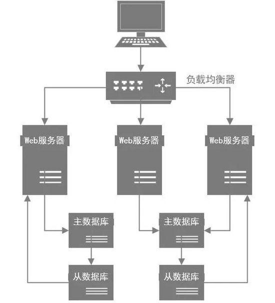

# MySQL 优化

# 表设计原则

## 1、类型选择

原则：尽量选用可以正确存储数据的最小类型

特点：更小的数据类型具备速度快、占用更少的磁盘、内存、CPU缓存，CPU 处理周期


遵守准则：

1.  **主键最好定义为增长主键**，字符字段最好不要做主键
2.  **避免NULL**，需要更多的存储空间、性能低、很难优化，推荐默认值代替null
3.  **使用TIMESTAMP而非DATETIME**，优点：TIMESTAMP只使用DATETIME一半的存储空间、并且会根据时区变化，缺点TIMESTAMP的时间范围要小
4.  **使用 decimal存储小数非 float和double**
5.  **尽量使用INT而非BIGINT**，如果非负则加上UNSIGNED（这样数值容量会扩大一倍），当然能使用TINYINT、SMALLINT、MEDIUM_INT更好。
6.  **使用枚举或整数代替字符串类型**。如性别：可以使用 `tinyint`，它比 char 更合适。枚举实际上就是TINYINT存储
7.  **尽量使用INT而非BIGINT**，如果非负则加上UNSIGNED（这样数值容量会扩大一倍），当然能使用TINYINT、SMALLINT、MEDIUM_INT更好。
8.  **尽可能的使用 varchar代替 char**，因为首先变长字段存储空间小，可以节省存储空间，其次对于查询来说，在一个相对较小的字段内搜索效率显然要高些。
9.  单表不要有太多字段，建议在20以内。
10.  尽量少用text，非用不可最好分表。


**UUID主键和自增主键的区别**：

* UUID主键插入行不仅花费的时间更长，而且索引占用的空间更大，这是因为UUID主键字段更长，且会有页分裂和碎片存在导致。
* 自增主键插入式顺序插入。存在并发插入时导致间隙锁竞争


## 2、最佳实践：

*   使用MySQL 内建的类型来存储日期和时间，而非字符串类型
*   整型(UNSIGNED INT)存储IP地址，MySQL提供INET_ATON把字符串的IP转换成整数，以及INET_NTOA把整数IP转换成字符串
*   char 类型适合存储密码的MD5值，因为这是一个定长值


# SQL 优化

## 常见优化方案

- 避免select *，将需要查找的字段列出来。
- 控制 in 的个数建议在200内，建议 exists 代替 in
- 使用连接（join）来代替子查询，执行子查询时，MYSQL需要创建临时表，查询完毕后再删除这些临时表。但是尽量少用JOIN 查询，尽量单表查询
- 不要在 where 子句中的“=”左边进行函数、算术运算或其他表达式运算，如日期转换，date_format(create_time,'%Y-%m-%d') = '2019-08-02'
- 使用多列索引时注意顺序和查询条件保持一致，同时删除不必要的单列索引
- 避免%xxx式查询
- 当只要一行数据时使用 LIMIT 1


## EXPLAIN

获取查询执行计划的信息

explain 的输出列

* **id** ： SELECT识别符。这是SELECT的查询序列号
* **select_type**：SELECT类型
* **table** ：输出的行所引用的表
* **type**：联接类型。从最佳类型到最坏类型进行排序：system>const>eq_ref>ref>ref_or_null>index_merge>unique_subquery>index_subquery>range>index>ALL
* **possible_keys**：指出MySQL能使用哪个索引在该表中找到行
* **key**：显示MySQL实际决定使用的键(索引)。如果没有选择索引,键是NULL。
* **key_len**：显示MySQL决定使用的键长度，如果键是NULL,则长度为NULL。
* **ref**：显示使用哪个列或常数与key一起从表中选择行。
* **rows**：显示MySQL认为它执行查询时必须检查的行数。多行之间的数据相乘可以估算要处理的行数。
* **filtered**：显示了通过条件过滤出的行数的百分比估计值。
* **Extra**：该列包含MySQL解决查询的详细信息


### select_type

SELECT类型,可以为以下任何一种:

- **SIMPLE**：简单SELECT(不使用UNION或子查询)
- **PRIMARY**：最外面的SELECT
- **UNION**：UNION中的第二个或后面的SELECT语句
- **DEPENDENT UNION**：UNION中的第二个或后面的SELECT语句,取决于外面的查询
- **UNION RESULT**：UNION 的结果
- **SUBQUERY**：子查询中的第一个SELECT
- **DEPENDENT SUBQUERY**：子查询中的第一个SELECT,取决于外面的查询
- **DERIVED**：导出表的SELECT(FROM子句的子查询)


### type

联接类型。下面给出各种联接类型,按照从最佳类型到最坏类型进行排序:

- **system**：表仅有一行(=系统表)。这是const联接类型的一个特例。
- **const**：表最多有一个匹配行,它将在查询开始时被读取。因为仅有一行,在这行的列值可被优化器剩余部分认为是常数。const表很快,因为它们只读取一次!
- **eq_ref**：索引查找，最多从该表中读取一行。一般使用主键或唯一索引
- **ref**：索引访问
- **ref_or_null**：ref 的变体，表示MySQL必须在初次查找的结果里进行第二次查找已找出null条数
- **index_merge**:该联接类型表示使用了索引合并优化方法。
- **unique_subquery**:该类型替换了下面形式的IN子查询的ref: value IN (SELECT primary_key FROM single_table WHERE some_expr) unique_subquery是一个索引查找函数,可以完全替换子查询,效率更高。
- **index_subquery**:该联接类型类似于unique_subquery。可以替换IN子查询,但只适合下列形式的子查询中的非唯一索引: value IN (SELECT key_column FROM single_table WHERE some_expr)
- **range**：范围扫描，where 带有`between` 或者 `>`、`<` 等符号
- **index**：和全表扫描一样，只是MySQL扫描表时按索引持续进行而不是行（按索引排序）
- **ALL**：全表扫描

### Extra

该列包含MySQL解决查询的详细信息，常见的重要的值如下：

* `Using index`：表示MySQL将使用覆盖索引，以避免访问表。
* `Using where`：表示MySQL将在存储引擎检索行后在进行过滤，暗示：查询可受益于不同的索引
* `Using temporary`：表示MySQL对查询结果排序时会使用一个临时表
* `Using filesort`：表示MySQL对查询结果使用一个外部索引排序

其他：

- **Distinct**:MySQL发现第1个匹配行后,停止为当前的行组合搜索更多的行。
- **Not exists**:MySQL能够对查询进行LEFT JOIN优化,发现1个匹配LEFT JOIN标准的行后,不再为前面的的行组合在该表内检查更多的行。
- **range checked for each record (index map: #)**:MySQL没有发现好的可以使用的索引,但发现如果来自前面的表的列值已知,可能部分索引可以使用。
- **Using sort_union(...), Using union(...), Using intersect(...)**:这些函数说明如何为index_merge联接类型合并索引扫描。
- **Using index for group-by**:类似于访问表的Using index方式,Using index for group-by表示MySQL发现了一个索引,可以用来查 询GROUP BY或DISTINCT查询的所有列,而不要额外搜索硬盘访问实际的表。


# 索引设计原则

1. **索引的列选择查询频繁的列，在where，group by，order by，on从句中出现的列**，⽽不是出查询结果集总的列
2. **索引的列的基数越⼤，索引的效果越好**。例如，存放出⽣⽇期的列具有 不同值，很容易区分各⾏。值分布很稀少的字段不适合建索引，如⽤来记录性别的列，只含有“M”和“F”，则对此列进⾏索引没有多⼤⽤处
3. **使⽤短索引。**如对字符串列进⾏索引，应该指定⼀个前缀长度
4. **最左前缀原则**。联合索引根据最左原则可起⼏个索引的 作⽤
5. 避免在WHERE子句中对字段进行NULL值判断
6. 字符字段只建前缀索引


* 优先 WHERE 子句中的排序、分组和范围

* 当不需要考虑排序和分组时，将选择性最高的列放在前面。

  确认顺序方法，如：

  ```sql
  select * from payment where staff_id = 2 and customer_id 584 ;
  ```

  计算：

  ```sql
  select 
  	count(distinct staff_id)/count(*) as staff_id_selectivity,
  	count(distinct customer_id)/count(*) as customer_id_selectivity,
  	count(*)
  from payment 
  ******************** 1.row ************************
  	staff_id_selectivity：0.0001
   customer_id_selectivity：0.0373
  				   count：16049
  ```

  从以上结果，customer_id 的选择性更高，所以应该将其作为索引列的第一列


---

# 索引失效

## 最左原则

对于联合索引，多个索引列必须从左至右的出现在where中，

如：索引（a，b，c）

* 索引有效：where a=xx and b=xx  或者 where b=xx and a=xx
* 索引无效：where b=xx and c=xx


## 模糊查询

字符串类型的索引列在where 中使用了like和通配符%，如下：当%位于最左边的索引列时无法使用索引，否则可以继续使用索引。所以避免%xxx式查询

如：索引（a，b，c）

- 索引有效：where a=xx and b like '%xx '
- 索引有效：where a 'xx% ' and b=xx
- 索引无效：where a '%xx ' and b=xx


## 隐式转换

数据类型隐式转换是指查询条件中的索引列对应的值的类型和列的类型不一致；

**数字转字符串类型**，联合索引时，在最左原则下生效

如 ：索引列  a  为 varchar 类型

* 索引有效：where a = '1'
* 索引无效：where a = 1

如 ：索引列  a  为 int  类型

- 索引有效：where a = '1'  或者   where a =  1

如 ：索引列（a,b）  a  为 int  类型

- 索引无效：where a = '1'  

如 ：索引列（a,b）  b  为 int  类型

- 索引有效：where b = '1'  and a = ''


## OR /IN 查询

**OR**

innodb引擎，使用OR 查询所有列会是索引失效，OR 两边的列都是不能使用索引

但是，可以使用`覆盖索引`，或者使用`UNION替代`


**IN** 

in 和 not in 也要慎用，否则会导致全表扫描

* 索引有效：in ('a')
* 索引无效：in （'a' , 'b'）


## 函数使用

索引列参与到函数计算时索引失效

**简单加减运算**

不要在 where 子句中的“=”左边进行函数、算术运算或其他表达式运算，负责索引会失效

如：索引（a）

* 索引无效 ：a /2 = 10  可以改为 a = 10*2

**索引列参与到MySQL函数**

如：substring(name,1,3)=’abc’


**最常见的就是有索引的时间字段了，千万不要在这类字段上使用函数，否则会索引实现**


## 空值判断

索引列在使用 `is null`  或者 `is not  null` 判断时，索引会失效

eg：经过测试 is null 并不会失效，


## 不等号

尽量避免在 where 子句中使用`!=`或`<>`操作符，否则将引擎放弃使用索引而进行全表扫描。


**注意**
以下说法在网上很流行，但经过小编测试，发现说法有误

1、尽量避免在 where 子句中使用!=或<>操作符，否则将引擎放弃使用索引而进行全表扫描。

无论哪种InnoDB还是MyISAM 引擎，使用HASH索引或者BTREE 索引，!=或<>操作符不会使索引失效（MySQL版本8.0.16）


# 分表分区分库

## 分表

- 分表就是把一张大表，按照如上过程都优化了，还是查询卡死，那就把这个表分成多张表，把一次查询分成多次查询，然后把结果组合返回给用户。
- 分表分为**垂直拆分**和**水平拆分**，通常以某个字段做拆分项。比如以id字段拆分为100张表：表名为 tableName_id%100。
- 但：分表需要修改源程序代码，会给开发带来大量工作，极大的增加了开发成本，故：只适合在开发初期就考虑到了大量数据存在，做好了分表处理，不适合应用上线了再做修改，成本太高！！！故不建议采用。

## 分库

- 把一个数据库分成多个，建议做个读写分离就行了，真正的做分库也会带来大量的开发成本，得不偿失！不推荐使用。

