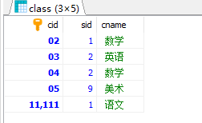

# SQL基础

# 数据类型

## 整数类型

可以使用的整数类型有：TINYINT，SMALLINT，MEDIUMINT，INT，BIGINT。分别使用   8、16、24、32、64位存储空间。存储范围从-2^(N-1)^ 到  2^(N-1)^ - 1，其中N是存储空间位数

整数类型有可选的 `unsigned` 属性，表示不允许负值，可以使正数的上限提高一倍，例如：tinyint unsigned 范围是0~255，而tinyint 的存储范围是 128~127


整数类型可以指定宽度，如 int (n) ：n 表示 zerofill  状态下，显示的最少字符长度，与存储空间大小无关（int 都在4个字节长度）




---

小数类型，使用decimal、float、double。其中decimal用于存储精确的小数，如存储财务数据。

decimal存储是每4个字节存9个数字，MySQL5.0 后允许存储最多65个数字

float 使用4个字节存储

double 使用8个字节存储


## 字符串类型

MySQL支持多种字符串类型，且每种类型还有很多变种。其中 `varchar`和`char` 为两种主要的类型

* char(n) ：固定长度，自动填充至n 个字符长度，最多255字符。不易产生空间碎片。

* varchar(n)：可变长度，比定长类型更省空间 ，需要1个或者2个字节表示长度（>=255时2个）

CHAR 存储时MySQL会删除所有的末尾空格，varchar 不会（4.1 之前会）


*   binary和varbinary ：char 和varchar类似，用于存储二进制数据
*   blob 和text类型：分别存储二进制和字符，Memory 引擎不支持该类型，不过需要使用MyISAM 引擎


## 枚举类型

有时候可以使用枚举代替常用的字符串类型。枚举列一般会将不重复的字符串存储成一个预定义的结合

通常枚举列是以tinyint 存储的，所以需要避免数组作为枚举常量。

缺点：字符串列表固定，添加或删除字符串必须使用ALTER TABLE


## 日期和时间类型

MySQL提供两种相似的日期类型：datetime 和 timestamp

*   datetime ，从1001年到9999年，精度秒，8个字节，与时区无关
*   timestamp，从1970 到 2038年，精度秒，4个字节，依赖时区，与UNIX 时间戳相同，可用from_unixtime()和unix_timestamp()进行时间戳和日期的互转。并且默认 NOT NULL

推荐使用timestamp类型，它比datetime的空间效率更高


# 连接查询

mysql 连接查询分：

- **INNER JOIN（内连接,或等值连接）**
- **LEFT JOIN（左连接）**
- **RIGHT JOIN（右连接）**

举例说明：

student、class 表如下：

```sql
SELECT * FROM student;
+-----+-------+
| sid | sname |
+-----+-------+
|   1 | aaa   |
|   2 | bbb   |
|   3 | ccc   |
|   4 | ddd   |
+-----+-------+

SELECT * FROM class;
+-----+------+-------+
| cid | sid  | cname |
+-----+------+-------+
|   1 |    1 | 语文  |
|   2 |    1 | 数学  |
|   3 |    2 | 英语  |
|   4 |    2 | 数学  |
|   5 |    9 | 美术  |
+-----+------+-------+
```

## INNER JOIN

```sql
SELECT * FROM student s inner JOIN class c ON c.sid = s.sid;
+-----+-------+-----+------+-------+
| sid | sname | cid | sid  | cname |
+-----+-------+-----+------+-------+
|   1 | aaa   |   1 |    1 | 语文  |
|   1 | aaa   |   2 |    1 | 数学  |
|   2 | bbb   |   3 |    2 | 英语  |
|   2 | bbb   |   4 |    2 | 数学  |
+-----+-------+-----+------+-------+
```

**从上数据可以看出：并不包含student表中sid=3、4的数据（即 sname 为 ccc、ddd 的数据），也不包含class 表中的 sid =9 的数据**

从笛卡尔积的角度：就是从笛卡尔积中**挑出ON子句条件成立的记录**

**即：查出两个表中所有满足 `ON` 条件的数据，即`两个表的交集`**


## LEFT JOIN

```sql
mysql> SELECT * FROM student s LEFT  JOIN class c ON c.sid = s.sid;
+-----+-------+------+------+-------+
| sid | sname | cid  | sid  | cname |
+-----+-------+------+------+-------+
|   1 | aaa   |    1 |    1 | 语文  |
|   1 | aaa   |    2 |    1 | 数学  |
|   2 | bbb   |    3 |    2 | 英语  |
|   2 | bbb   |    4 |    2 | 数学  |
|   3 | ccc   | NULL | NULL | NULL  |
|   4 | ddd   | NULL | NULL | NULL  |
+-----+-------+------+------+-------+
```

从笛卡尔积的角度讲，就是先从笛卡尔积中挑出ON子句条件成立的记录，然后加上左表中剩余的记录（见最后三条）。

**即：查出两个表中所有满足 `ON` 条件的数据，外加`左表`不满足`ON`的数据**


## RIGHT JOIN

```sql
mysql> SELECT * FROM student s RIGHT  JOIN class c ON c.sid = s.sid;
+------+-------+-----+------+-------+
| sid  | sname | cid | sid  | cname |
+------+-------+-----+------+-------+
|    1 | aaa   |   1 |    1 | 语文  |
|    1 | aaa   |   2 |    1 | 数学  |
|    2 | bbb   |   3 |    2 | 英语  |
|    2 | bbb   |   4 |    2 | 数学  |
| NULL | NULL  |   5 |    9 | 美术  |
+------+-------+-----+------+-------+
```

同理右连接RIGHT JOIN就是求两个表的交集外加右表剩下的数据。再次从笛卡尔积的角度描述，右连接就是从笛卡尔积中挑出ON子句条件成立的记录，然后加上右表中剩余的记录（见最后一条）。

**即：查出所有满足 `ON` 条件的数据，外加`右表`不满足`ON`的数据**